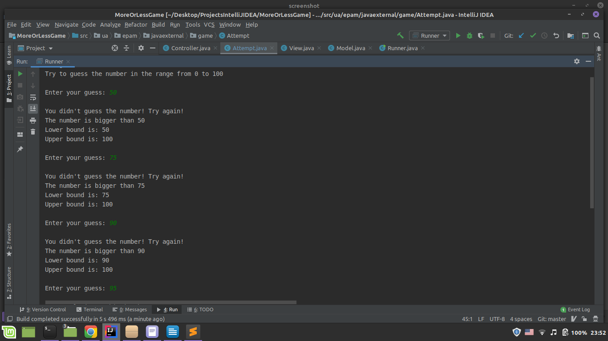
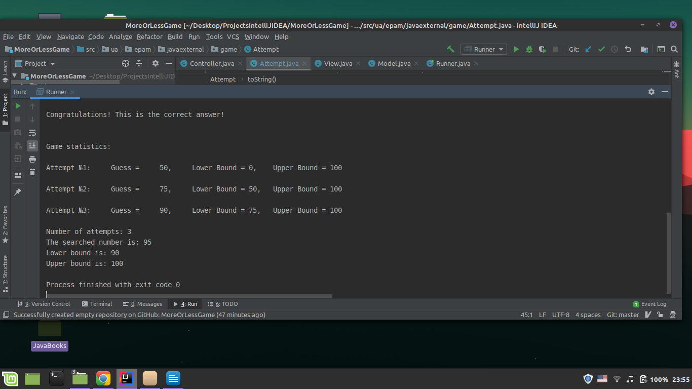

# more-or-less-game
> This is a java game program that uses MVC pattern.

## Table of contents
* [General info](#general-info)
* [Screenshots](#screenshots)

## General info
* This is a java game program that uses MVC pattern.
* The program generates a random number in the rang from 0 to 100.
* A user should guess the number. After every attempt of the user to guess the number the range of the numbers decreases.
* The program gives some hints if the number is bigger or smaller than users's guess.
* In the end of the game the user gets all the statistics of the game.
* The main target of this project is learning MVC pattern

## Screenshots

## Contact
Created by [@flynerdpl](https://www.flynerd.pl/) - feel free to contact me!

